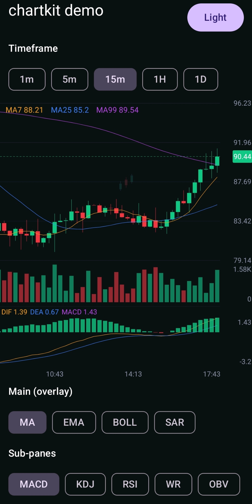

# chartkit

[简体中文](README.md) | English

A high-performance, extensible **K-line (candlestick) chart** for Android, built entirely in Jetpack Compose. Inspired by the trading charts in OKX / Binance.

- **Pure Compose** — everything draws on one `Canvas`; no `AndroidView`, no third-party chart engine.
- **Smooth UX** — skeleton ghost chart before data arrives, entrance reveal animation, live rolling-number legend, continuous indicator lines, animated sub-pane add/remove, crossfade on timeframe switch.
- **Off-main-thread indicators** — computed on `Dispatchers.Default`, coalesced per data version; live ticks recompute only the last bar (incremental), not the whole series.
- **Extensible** — add a main/sub indicator from a single lambda; stack multiple sub-panes.

## Demo



https://github.com/user-attachments/assets/7bc1ff7e-96d2-4090-954a-25da83fd9d92

```
chartkit/
├── core/      # pure Kotlin/JVM: Candle, TimeFrame, Indicator + builtins (unit-tested)
├── compose/   # Android library: KLineChart composable, state, theme
└── kmp/       # Compose Multiplatform library (Android/iOS/Desktop), reuses core + compose sources → chartkit-kmp
```

---

## Install

Published via [JitPack](https://jitpack.io). Add the repository, then depend on `compose` (it re-exposes `core`, so one line is enough):

```kotlin
// settings.gradle.kts
dependencyResolutionManagement {
    repositories {
        google()
        mavenCentral()
        maven { url = uri("https://jitpack.io") }
    }
}

// module build.gradle.kts
implementation("com.github.ccBiver.chartkit:chartkit-compose:0.1.4")
```

Requires `minSdk 24` and Compose enabled. See [PUBLISHING.md](PUBLISHING.md) for coordinates, versions and release details.

> Prefer to vendor the source? Copy `core/` and `compose/` into your project, `include(":core", ":compose")`, then `implementation(project(":compose"))`.

### Compose Multiplatform (Android / iOS / Desktop)

For cross-platform use, depend on the KMP artifact `chartkit-kmp` (same rendering code; native Android can still use `chartkit-compose` above):

```kotlin
// commonMain
implementation("com.github.ccBiver.chartkit:chartkit-kmp:0.1.4")
```

Targets: `androidTarget`, `iosX64/iosArm64/iosSimulatorArm64`, `jvm` (Desktop). The API matches the Android version — call `@Composable fun KLineChart(...)` directly from `commonMain`. Difference: fullscreen (`launchChartFullscreen`, which relies on an Android `Activity`) is Android-only; on KMP, drive fullscreen yourself via the `onToggleFullscreen` callback.

Cross-platform sample `:composeApp` (one `App()` for Android / iOS / Desktop, with timeframe/indicator toggles and light/dark):

```bash
# Desktop (opens a window)
./gradlew :composeApp:run

# Android (needs a device/emulator, or run "composeApp" from Android Studio)
./gradlew :composeApp:installDebug

# iOS: open iosApp/iosApp.xcodeproj in Xcode, pick a simulator, Run
#      (a build phase runs Gradle to produce & embed ComposeApp.framework)
open iosApp/iosApp.xcodeproj
```

> `:demo` (native Android, on `chartkit-compose`) still works: `./gradlew :demo:installDebug`. `:composeApp` exercises the KMP `chartkit-kmp` path.

Run the bundled sample with `./gradlew :demo:installDebug` (see [`demo/`](demo/)).

---

## Quick start

```kotlin
@Composable
fun MyChart(rows: List<Candle>) {
    val state = rememberKLineChartState(timeFrame = TimeFrame.M15)

    LaunchedEffect(rows) { state.applyUpdate(KLineUpdate.RESET, rows) }

    KLineChart(
        state = state,
        modifier = Modifier.fillMaxWidth().height(320.dp),
        theme = ChartTheme.Dark,
        upDownColor = UpDownColor.GreenUpRedDown,
        mainIndicators = listOf(Ma(intArrayOf(7, 25, 99))),
        subIndicators = listOf(Macd(), Kdj()),
    )
}
```

`Candle` (immutable; `time` is epoch millis of the bar open):

```kotlin
data class Candle(
    val time: Long,
    val open: Double, val high: Double, val low: Double, val close: Double,
    val volume: Double = 0.0, val turnover: Double = 0.0,
)
```

---

## `KLineChart` parameters

Change behavior by passing these to the composable. All have sensible defaults.

| Parameter | Type | Default | What it controls / how to change |
|---|---|---|---|
| `state` | `KLineChartState` | — | Data + viewport host. Create with `rememberKLineChartState()`. |
| `theme` | `ChartTheme` | `Dark` | Colors + sizes. Use `ChartTheme.Light`, or `.copy(...)` to tune (see below). |
| `upDownColor` | `UpDownColor` | `GreenUpRedDown` | Up/down color convention. Set `RedUpGreenDown` for CN-style. |
| `mode` | `ChartMode` | `Candle` | `Candle` for candlesticks, `TimeLine` for a line+area chart. |
| `mainIndicators` | `List<Indicator>` | `[]` | Overlays on the price pane, e.g. `listOf(Ma(), Boll(20, 2.0))`. |
| `subIndicators` | `List<Indicator>` | `[]` | Each becomes its own stacked sub-pane, e.g. `listOf(Macd(), Kdj())`. |
| `formatter` | `ChartFormatter` | `Default` | Price/volume/time formatting (precision, thousands, locale). |
| `entranceAnimation` | `Boolean` | `true` | Left→right reveal on first load / timeframe switch. Set `false` to disable. |
| `showVolume` | `Boolean` | `true` | Show the volume pane. |
| `tradeMarks` | `List<TradeMark>` | `[]` | Buy/sell markers on bars (clickable). |
| `logo` | `Painter?` | `null` | Watermark image. `painterResource(R.drawable.x)`. |
| `logoPosition` | `LogoPosition` | `Center` | `Center`, `TopStart`, `TopEnd`, `BottomStart`, `BottomEnd`. |
| `logoAlpha` | `Float` | `0.10f` | Watermark opacity (0..1). |
| `logoHeight` | `Dp` | `32.dp` | Watermark height. |
| `showSkeleton` | `Boolean` | `true` | Ghost candlestick skeleton while data is empty. |
| `blankScrollRatio` | `Float` | `0f` | Allow scrolling the latest bar off the right edge into blank space (Binance-style). `0` = pinned right; `0.5f` = up to half a screen of blank. |
| `crosshairMode` | `CrosshairMode` | `Free` | `Free` = horizontal line follows finger; `SnapToClose` = snaps to close. |
| `crosshairDismiss` | `CrosshairDismiss` | `Persistent` | `Persistent` = stays after release, dismissed by tap/scroll/zoom; `OnRelease` = disappears on finger lift. Also changes trade-mark interaction (see below). |
| `lastPriceMode` | `LastPriceMode` | `Latest` | Right-axis price line/label source. `Latest` (industry standard) = always the latest trade price; when the last bar is scrolled off-screen and its price falls outside the visible range, the label pins to the top/bottom edge instead of disappearing. `RightmostVisible` = follows the rightmost visible bar's close (value + color track it). |
| `labels` | `ChartLabels` | `ChartLabels()` | Localized labels for the built-in tooltip fields. |
| `crosshairDetail` | `((Candle) -> List<CrosshairDetailRow>)?` | `null` | `null` = built-in full panel (time/OHLC/change/change%/amplitude/volume/turnover, auto-computed). Pass a lambda to fully override. |
| `onToggleFullscreen` | `(() -> Unit)?` | `null` | If non-null, a button is shown bottom-left and this is called on tap. |
| `onLoadMore` | `() -> Unit` | `{}` | Called when the user scrolls near the oldest bar (paging). |
| `onCrosshairChange` | `(Candle?) -> Unit` | `{}` | Focused candle while long-pressing (null on release). |
| `onTradeMarkClick` | `(TradeMark) -> Unit` | `{}` | A trade marker was tapped. |

---

## Tuning sizes & colors — `ChartTheme` / `ChartDims`

`ChartTheme` and `ChartDims` are data classes — `copy(...)` what you need:

```kotlin
val theme = ChartTheme.Dark.copy(
    dims = ChartTheme.Dark.dims.copy(
        candleDefaultWidth = 6.dp,   // thinner/denser candles
        axisTextSize = 9.sp,         // axis / readout text
        legendTextSize = 10.sp,      // top legend (MA7 …, DIF …)
        rightAxisWidth = 52.dp,      // room for price labels
        bottomAxisHeight = 18.dp,    // time-axis band height
        paneGap = 6.dp,              // gap between panes
    ),
)
```

`ChartDims` fields: `candleMinWidth` (3.dp), `candleMaxWidth` (30.dp), `candleDefaultWidth` (8.dp), `candleGapRatio` (0.25f), `axisTextSize` (10.sp), `legendTextSize` (11.sp), `rightAxisWidth` (46.dp), `bottomAxisHeight` (18.dp), `paneGap` (6.dp).

Colors and grid live directly on `ChartTheme` (`background`, `grid`, `axisText`, `crosshair`, `lastPriceLine`, `indicatorColors`, `upColor`/`downColor` via `upDownColor`, …) — `copy()` those too.

---

## Number & time formatting — `ChartFormatter`

```kotlin
formatter = ChartFormatter(
    price = { v -> String.format(java.util.Locale.US, "%,.2f", v) },  // 62,978.00
    volume = { v -> compact(v) },                                     // 9.17K
    time = { t, tf -> /* axis ticks */ },
    crosshairTime = { t, tf -> /* full date for the crosshair label */ },
)
```

> Tip: pin a `Locale` for prices, otherwise the JVM default locale may swap the decimal/grouping separators.

---

## Driving updates — `KLineUpdate`

The host owns the data; drive the chart with one constant:

| `KLineUpdate` | When | Effect |
|---|---|---|
| `RESET`  | first load / timeframe switch (full list) | replaces all, snaps to latest, replays entrance |
| `LATEST` | full list incl. a new/updated last bar | replace last by time, else append |
| `MORE`   | full list with older bars prepended | prepends the leading delta, keeps scroll position |

```kotlin
state.applyUpdate(KLineUpdate.RESET, fullList)
```

### Live ticks

Push the latest bar straight in (O(1), no full re-map):

```kotlin
LaunchedEffect(Unit) { tickFlow.collect { state.appendOrUpdate(it) } }
```

`appendOrUpdate` replaces the last bar if the time matches, otherwise appends.

---

## Indicators

Built-ins (`com.biver.chartkit.indicator.builtin`):

| Pane | Indicators |
|---|---|
| Main overlay | `Ma`, `Ema`, `Boll`, `Sar` (parabolic SAR, drawn as scatter points) |
| Sub-pane | `Macd`, `Kdj`, `Rsi`, `Wr` (Williams %R), `Obv` (on-balance volume), `VolMa` |

```kotlin
mainIndicators = listOf(Ma(intArrayOf(7, 25, 99)), Boll(20, 2.0), Sar())
subIndicators  = listOf(Macd(12, 26, 9), Kdj(), Rsi(intArrayOf(6, 12, 24)), Wr(intArrayOf(14)), Obv())
```

Call `Indicators.registerDefaults()` once to register all built-ins in `ChartRegistry` (lookup by id).

### Custom indicator from a formula

Add a main/sub indicator with one lambda — no subclassing:

```kotlin
val vwap = indicator("VWAP", Pane.Sub) { candles ->
    listOf(IndicatorLine("VWAP", candles.runningVwap()))  // List<Double?> aligned to candles
}
KLineChart(state = state, subIndicators = listOf(vwap), /* ... */)
```

Rules:
- Output lines are **the same length as the candle list, index-aligned**.
- Use `null` for "no value" (e.g. warm-up window) — the renderer skips nulls without connecting (lines never break or drop to 0).
- `compute` must be **pure** (it runs on a background thread). Multi-line indicators (MACD = DIF + DEA + histogram) return several `IndicatorLine`s. Pick a draw style per line via `LineStyle`: `Line` (default), `Histogram` (MACD bars), or `Points` (scatter, e.g. SAR).
- Optionally set `lookback` (the `indicator(...)` DSL takes it, or override the property) to the number of trailing bars needed for the latest value. On a live tick the chart then recomputes just that window instead of the whole series. Leave it at the default `Int.MAX_VALUE` for path-dependent indicators (OBV, SAR) that must always recompute in full.

---

## Crosshair tooltip

Long-press shows a detail panel. **Out of the box (no `crosshairDetail`)** the library computes a full panel for the focused bar — time, open, high, low, close, change (signed + up/down colored), change %, amplitude, volume, turnover — using the injected `formatter` and `upDownColor`. You don't compute anything.

To localize, just pass label strings via `ChartLabels`:

```kotlin
KLineChart(
    state = state,
    labels = ChartLabels(
        time = "时间", open = "开", high = "高", low = "低", close = "收",
        change = "涨跌", changePct = "涨跌幅", amplitude = "振幅",
        volume = "量", turnover = "额",
    ),
)
```

Need different fields or layout? Override the whole panel with `crosshairDetail`:

```kotlin
crosshairDetail = { c ->
    listOf(
        CrosshairDetailRow("Close", fmt(c.close)),
        CrosshairDetailRow("Chg", sign + fmt(c.close - c.open), if (up) Color.Green else Color.Red),
    )
}
```

### Dismiss behavior — `crosshairDismiss`

| Mode | Crosshair | Trade-mark rows in tooltip | Trade-mark badge on chart |
|---|---|---|---|
| `Persistent` (default) | Stays after release; dismissed by a tap, scroll, or zoom | **Clickable** (with a `›`) → `onTradeMarkClick` | not tappable |
| `OnRelease` | Shows only while pressing; gone on release | shown but **not** clickable (no arrow) | **tap the badge** → `onTradeMarkClick` |

Pick `Persistent` when you want users to read/tap the panel after lifting their finger; pick `OnRelease` for a quick peek where the on-chart B/S badge is the tap target.

When `tradeMarks` are set, the focused bar's buy/sell records are appended to the tooltip (label + latest price + trade count), colored by `upDownColor`. Markers auto-hide when more than ~50 bars are visible.

---

## Architecture

- `:core` — plain Kotlin/JVM, unit-tested (`./gradlew :core:test`); SMA/EMA/BOLL/MACD/KDJ/RSI/WR/OBV/SAR have golden-value tests, plus a test asserting the `lookback` window reproduces the full-series last value.
- `:compose` — one `Canvas`; indicators via `produceState` on `Dispatchers.Default`, keyed by data version so rapid ticks coalesce, with last-bar-only incremental recompute (`IndicatorCache`). State is hoisted in `KLineChartState`.

## License

[MIT License](LICENSE).
